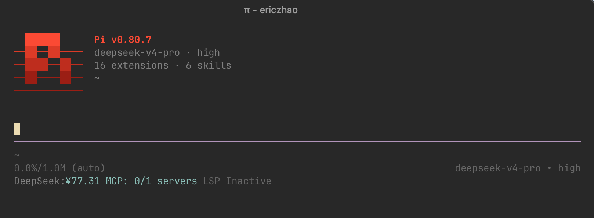
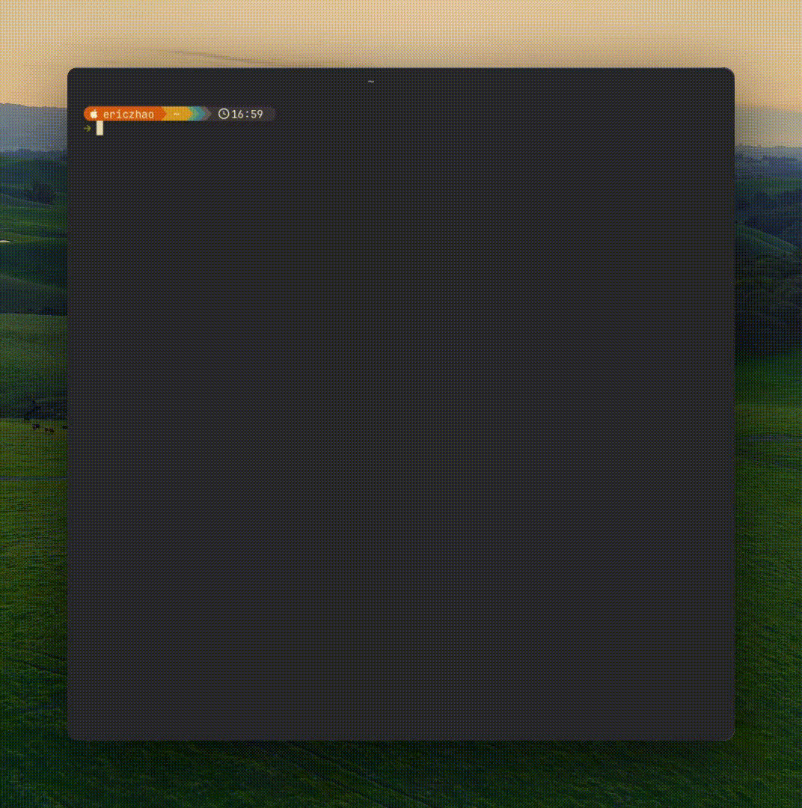

# pi-cc-header

[中文](#中文)

Animated Pi logo header for [pi coding agent](https://pi.dev).

## Features

- 14-frame Minecraft-style pixel animated Pi logo
- 9-color palette including Anthropic brand orange and Clawd crab red
- 4-level 24-bit true-color gradient
- IBM-style horizontal stripes
- Version number color modes
- Displays Pi version, model, thinking level, extension/skill counts, and cwd

## Commands

| Command | Description |
| --- | --- |
| `/hi` | Toggle IBM-style on/off |
| `/hc c/a/r/o/y/g/w/b/p` | Set logo color: c=clawd a=anthropic r=red o=orange y=yellow g=green w=white b=blue p=purple |
| `/hv` | Cycle version color: OFF → Pi only → Pi+ver |
| `/hm` | Toggle Minecraft-style on/off |
| `/hrl` | Toggle resource list visibility |
| `/htg` | Enable / disable pi-cc-header |
| `/hdf` | Reset to developer defaults |

### Disabled state

When pi-cc-header is disabled (`/htg`), all style commands are locked to prevent blind configuration. Use `/htg` again to re-enable. Changes apply on the next session.

## Auto behavior

- Force `quietStartup = true` on every session start
- Force clear scrollback on every session start

## Credits

Logo animation adapted from [pi.dev/install.sh](https://pi.dev/install.sh).

---

## 中文

[pi coding agent](https://pi.dev) 的 Pi logo 动画 header。

## 功能

- 14 帧 Minecraft 风格像素 Pi logo 动画
- 九色调色板：含 Anthropic 品牌橙与 Clawd 螃蟹红
- 4 级 24-bit 真彩色渐变
- IBM 风格水平横线
- 版本号颜色模式
- 显示 Pi 版本、模型、思考级别、扩展/技能数量、当前目录

## 命令

| 命令 | 说明 |
| --- | --- |
| `/hi` | 开关 IBM 横线 |
| `/hc c/a/r/o/y/g/w/b/p` | 设置 logo 颜色：c=clawd 螃蟹红 a=anthropic 品牌橙 r=red 红 o=orange 橙 y=yellow 黄 g=green 绿 w=white 白 b=blue 蓝 p=purple 紫 |
| `/hv` | 切换版本号颜色模式 |
| `/hm` | 开关 Minecraft 风格 |
| `/hrl` | 切换资源清单显示/隐藏 |
| `/htg` | 启用 / 禁用 pi-cc-header |
| `/hdf` | 恢复开发者默认配置 |

### 禁用状态

pi-cc-header 被禁用后，所有样式命令会被锁定，防止盲操配置。重新执行 `/htg` 即可恢复。更改将在下一次会话生效。

## 自动行为

- 每次启动强制 `quietStartup = true`
- 每次启动强制清屏

## 致谢

Logo 动画取自 [pi.dev/install.sh](https://pi.dev/install.sh)。
